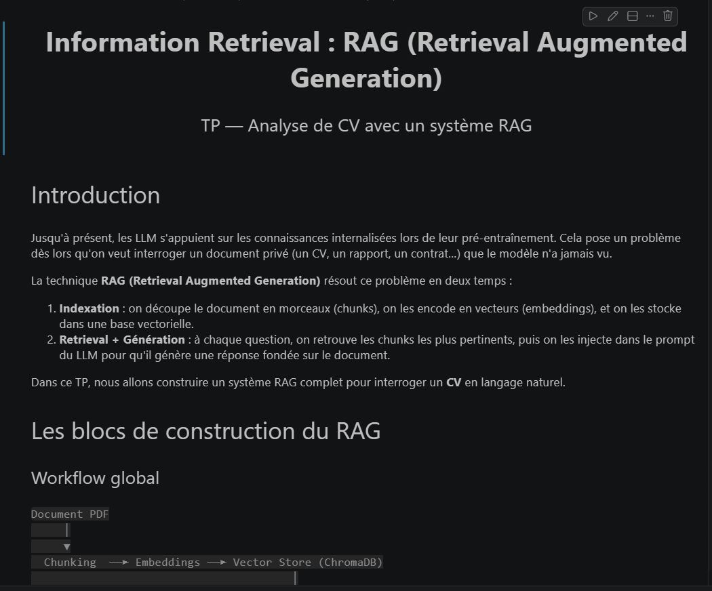
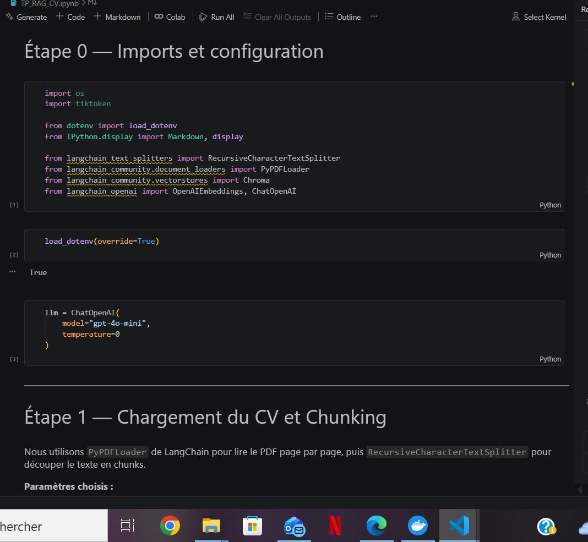
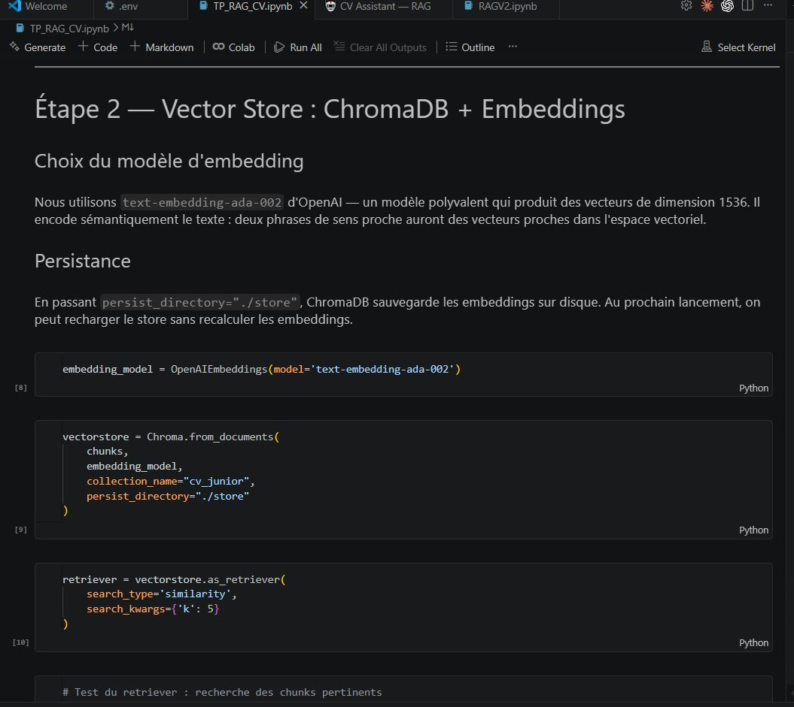
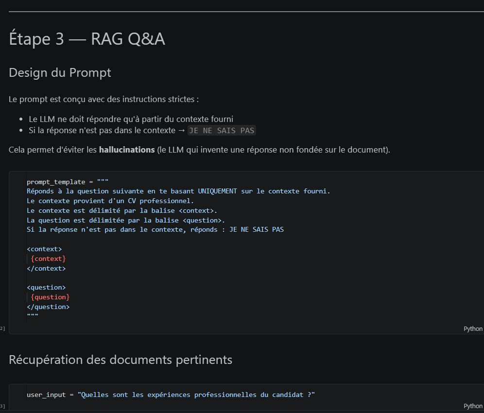
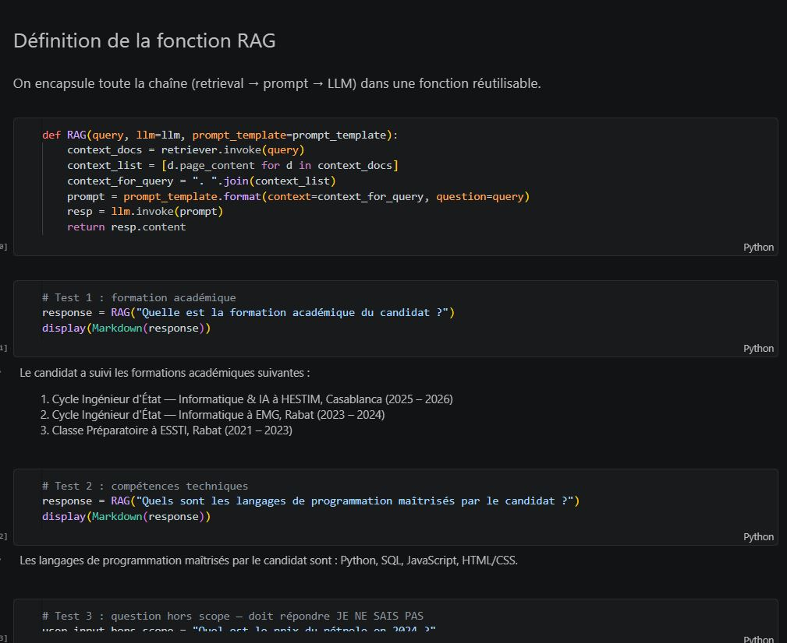
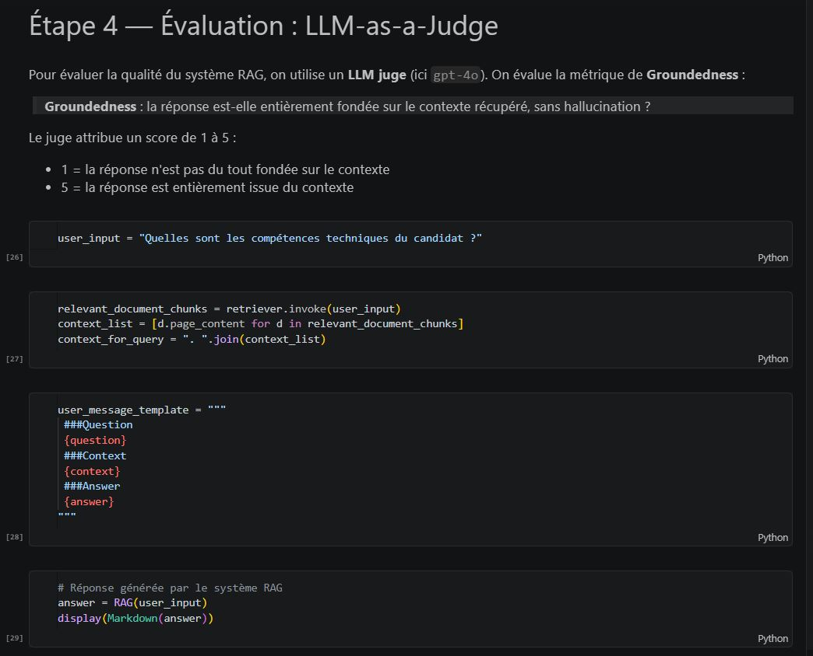
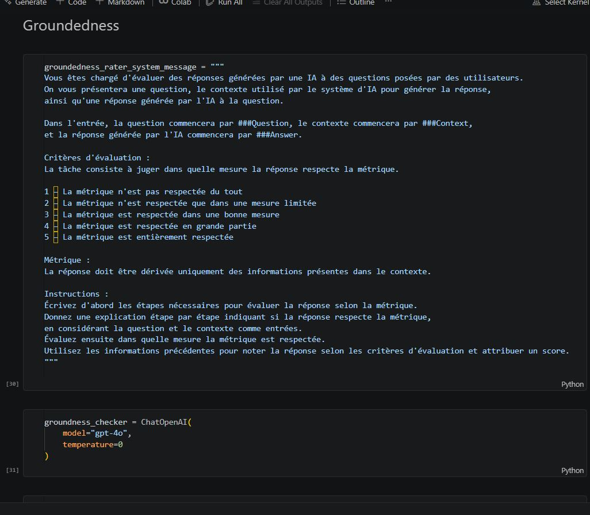
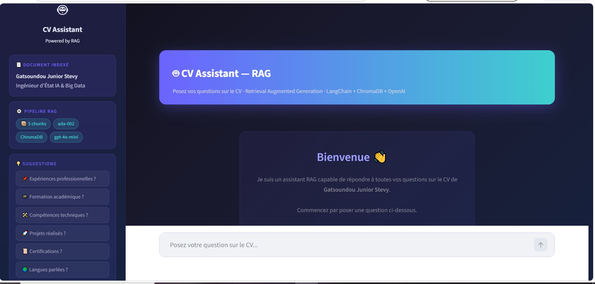

# 🤖 TP RAG & Agentic AI

> Système **Retrieval Augmented Generation (RAG)** complet pour interroger n'importe quel document PDF en langage naturel.

---

## 📌 Description

Ce projet implémente un pipeline RAG de bout en bout :

1. **Indexation** — le document PDF est découpé en chunks, encodé en vecteurs (embeddings) et stocké dans une base vectorielle ChromaDB.
2. **Retrieval** — à chaque question, les passages les plus pertinents sont récupérés par similarité sémantique.
3. **Génération** — les passages sont injectés dans un prompt structuré envoyé à GPT-4o-mini pour produire une réponse fondée uniquement sur le document.
4. **Évaluation** — un LLM juge (GPT-4o) évalue la qualité des réponses via la métrique de **Groundedness**.

---

## 🗂️ Structure du projet

```
├── TP_RAG_CV.ipynb       # Notebook pédagogique complet (RAG + évaluation)
├── app_cv.py             # Application Streamlit (interface chat dark mode)
├── RAGV2.ipynb           # Notebook modèle de référence
├── rag.py                # Application Streamlit modèle de référence
├── pyproject.toml        # Dépendances (uv)
└── .env                  # Variables d'environnement (non versionné)
```

---

## ⚙️ Stack technique

| Composant | Technologie |
|-----------|-------------|
| Chargement PDF | `LangChain PyPDFLoader` |
| Chunking | `RecursiveCharacterTextSplitter` (300 tokens, overlap 20) |
| Embedding | `text-embedding-ada-002` (OpenAI) |
| Vector Store | `ChromaDB` (persisté sur disque) |
| LLM | `GPT-4o-mini` / `GPT-4o` (évaluation) |
| Interface | `Streamlit` |
| Gestion deps | `uv` |

---

## 📊 Pipeline RAG

```
Document PDF
     │
     ▼
  Chunking  ──► Embeddings ──► ChromaDB (Vector Store)
                                        │
Question ──► Embedding ──► Retriever (top-5 chunks)
                                        │
                          Prompt = contexte + question
                                        │
                               GPT-4o-mini (LLM)
                                        │
                                    Réponse
```

---

## 📓 Notebook — TP_RAG_CV.ipynb

### Introduction & théorie RAG



### Étape 0 — Imports & configuration · Étape 1 — Chargement & Chunking



### Étape 2 — Vector Store : ChromaDB + Embeddings



### Étape 3 — RAG Q&A : Design du prompt



### Étape 3 — Fonction RAG & résultats



### Étape 4 — Évaluation : LLM-as-a-Judge



### Étape 4 — Groundedness



---

## 🖥️ Application Streamlit

Interface chat dark mode avec historique de conversation, sidebar informative et suggestions de questions.



---

## 🚀 Installation

```bash
# Cloner le repo
git clone https://github.com/gatsoundoujuniior-netizen/tp_RAG_et_agentic.git
cd tp_RAG_et_agentic

# Installer les dépendances
uv sync

# Configurer les clés API
# Créer un fichier .env avec :
# OPENAI_API_KEY=sk-...
```

---

## ▶️ Utilisation

### Notebook

```bash
uv run jupyter notebook TP_RAG_CV.ipynb
```

### Application Streamlit

```bash
uv run streamlit run app_cv.py
```

---

## 🔑 Variables d'environnement

```env
OPENAI_API_KEY=sk-...
GROQ_API_KEY=gsk_...      # optionnel
HF_TOKEN=hf_...           # optionnel
```
